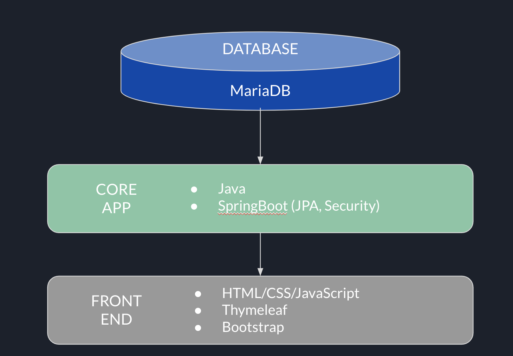
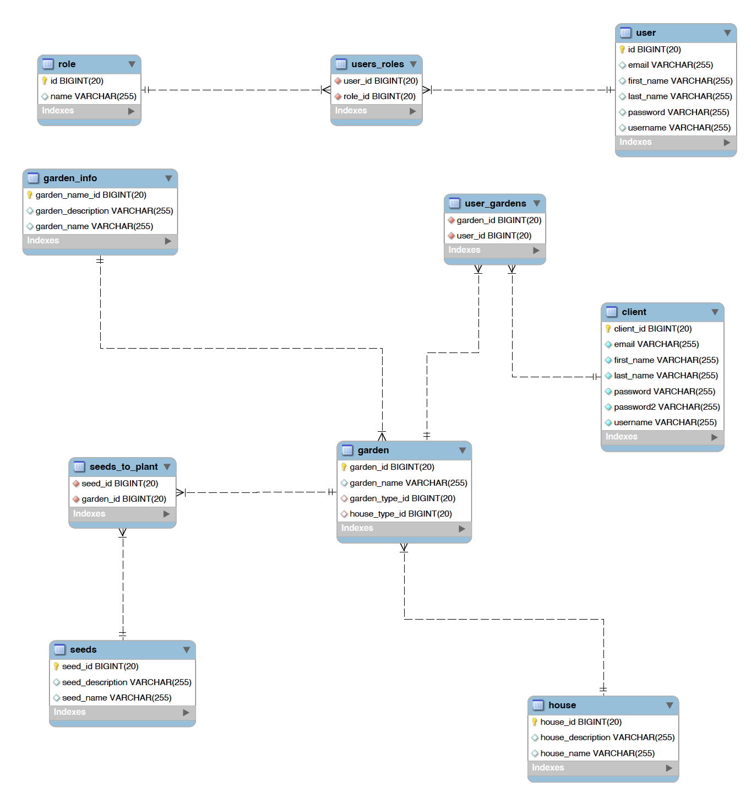

## Anakainosis

Add some description of the app (one or two paragraph)

## Contents

- [Daily Progress](#Daily-Progess)
  - [Capstone Requirement Checklist](https://docs.google.com/spreadsheets/d/1D3UE_JEeA2xT18aZkHMId0aTXXmIWYEhTA37o1_xwT4/edit?usp=sharing)
- [User Stories](#User-Stories)
    - [User](#User)
    - [Admin](#Admin)
- [Technical architecture](TechnicalArchitecture.png)
- [Technical challenegs addressed](#Technical-challenges)
- [Lessons learned from this project](#Lessons-learned)
- [Future improvements](#Future-improvements)
- [Wire frame](https://www.figma.com/file/68XBs5Bt57vc1ILSNEkVEs/Anakinosis?node-id=0%3A1)
- [Schema diagram](https://drive.google.com/file/d/15xa6slnXaxsCtZy8FFb98kUCv3k2bPju/view?usp=sharing)

## Daily Progress
- 4/26 (100% completed):
  - Resolved Issues with CRUD of Garden and User Connection. Finished up Readme file
#####
- 4/25 (98% Completed)
  - Completion of JUnit testing
  - Implementation of Web Service (Rest)
#####
- 4/24 (95% Completed):
  - Creation of JUnit testing for Service classes
#####
- 4/23 (90% Completed):
  - UI/UX adjustments to html tables
  - Added transaction logs to registration page
  - Fixed layout for Garden Seed Type layout so that the list will be shown in one column
#####
- 4/22 (80% Completed):
  - Modification of header so user is able to have access to their page
#####
- 4/21 (78% Completed):
    - Turned off spring security and implemented admin pages
  ######
- 4/22 (80% completed):
  - Implementation of sessions with logging in
  - Finished implementation of pulling the logged in user information and gardens that are tied with them
  - Connected the user and gardens that they created
  ######
- 4/20 (76% Completed):
  - Troubleshooting issues with a CRUD function not working with Spring Security
######
- 4/19 (75% completed):
    - Troubleshooting GitHub issues with branches not merged properly to master before branching again
#####
- 4/18 (70% completed):
    - Implementation of Spring Security
    - Troubleshooting issues with Spring Security with JS and CSS
    - Troubleshooting issues with Spring Security Registration Page
#####
- 4/15 (55-60% completed):
    - Completion of CRUD operations
  #####
- 4/1-4/14 (50% completed):
    - Implementation of CRUD operations on Registration and Create Garden

### Login
- As an admin, I want to log in with an admin privilege so that I can edit/update the list of items (seeds, garden type, house type) in the table, check the list of users and their garden lists they have created, etc. 
    - Tasks:
        1. Create a database and a User table containing username, password and privilege.
        2. Login screen asking for username and password.
        3. Check if the username exists in the User table
        4. Check if the password matches the entry in the table
        5. Assign the privilege to the current user login session
        6. If login is successful, show the main screen with options according to login privilege.

- As a user, I want to log in with a user privilege so that I can do basic operations like entering information to create a user's garden.
    - Tasks:
        1. Same as for admin login a-e
        2. If login is successful, show the screen for their account page.

## User Stories

### User
- As a user, I want to have a list of the gardens that I have created so that I can see the history of the gardens I have created in the past

- As a user, I want a my account page so that I can see my personal information that is associated with the account

- As a user, I want to be able to update the gardens so that I can change information of the garden after creating it

- As a user, I want to delete the gardens I created, so that I can delete any gardens that were made by mistake and if I no longer need it

- As a user, I want to be able to navigate to my account after logging in. so that I do not have to navigate from the home page directly

- As a user, I want to be re-directed to the login page after registering, so that I do not have to navigate to the login page directly.

### Admin
- As a admin, I want have a admin login feature, so that I am able to modify users, add other administrators

- As a admin, I want a desktop view of the website so that I can easily view the website on my monitor or laptop

#### Not implemented in this version:

- As a user, I want a mobile view of the website, so that I am able to use my phone without any UI/UX issues

- As a user, I want a mobile application of the program, so that I do not have to use the internet and have access to the application at all times

- As a user, I want to have a checkbox to check off if I have tried this garden method, so that I can know what works and what does not work for my living place

- As a user I want to have an text box to review the garden, so that I can note what went wrong and what I can do in the future

- As a admin, I want to have access to certain pages of all users and gardens so that I can see the number of users in the application and what gardens they have created

- As a admin, I want to have pages that will allow me to edit the information that is used in the garden creation form so that I do not need to update manually through the database and can easily access the database from the admin pages

## Technical architecture

## Technical challenges addressed
- Front End - UI/UX layout of HTML pages
- Issues with Join tables in database
- Spring Security Connectivity Issues
- Thymeleaf connection
- Github Issues

##Lessons learned from this project
- Growing in better understanding of Java and the ability to relate it to database and front end
- Increased knowledge in Front End programming
- Better understanding of Project Management Aspects
  - Understanding the User’s need in relation with User Stories
  - Not only getting the program to function but understanding of why it is needed
- Growing in area of organization in project file

## Future improvements
- To have a check box of if they had tried this garden method
- Having a rating system for the user to rate the garden that they have tried and area for review for future note
- Allowing user to update and delete their account
- Creation of Mobile view
- Creation of Mobile Application
- Incorporating vue/react with this program
- Linking Admin to admin pages and adding Admin features:
  - Implementation of GardenInfo, House, Seed pages - so admin can create, update, delete what is inputed in the garden creation form

## Wire frame

## Schema diagram

